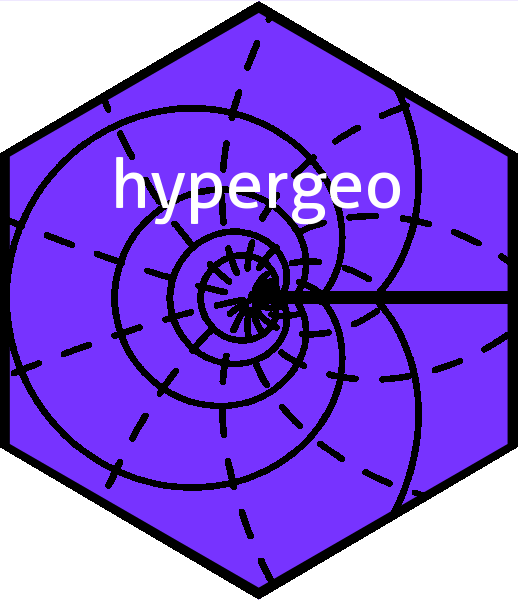

The `hypergeo` package: the Gauss hypergeometric function in R
================

<!-- README.md is generated from README.Rmd. Please edit that file -->

# 

<!-- badges: start -->

[](https://cran.r-project.org/package=hypergeo)
<!-- badges: end -->

To cite the package in publications, please use Hankin 2015.

# Overview

The `hypergeo` package provides functionality for working with the Gauss
hypergeometric function. The package uses a range of transformations to
ensure rapid numerical evaluation of the Gauss hypergeometric function,
and generalized hypergeometric functions. It is vectorized in argument
. If
 we
have

} =
\sum_{n\geqslant 0}\frac{(a)_n(b)_nz^n}{(c)_n n!}=
1+\frac{ab}{c}z +
\frac{a(a+1)b(b+1)}{c(c+1)2!}z^2 + \cdots")

where _n")
is the rising Pochhammer symbol; if

the series may be analytically continued.

# Installation

You can install the released version of `hypergeo` from
[CRAN](https://CRAN.R-project.org) with:

``` r
# install.packages("hypergeo")  # uncomment this to install the package
library("hypergeo")
```

# The `hypergeo` package in use

The main workhorse of the package is `hypergeo()`:

``` r
hypergeo(1/2,1/3,1/5, 1+8i)
#> [1] -0.0901118+0.2390856i
```

Observe that the hypergeometric series has radius of convergence one,
but analytic continuation is used to evaluate the function outside the
unit circle. The package works well with the visualization suite
provided by the `elliptic` package (Hankin 2008):

``` r
suppressMessages(library("elliptic"))
x <- seq(from=-2, to=2, len=100)
y <- x
z <- outer(x,1i*y, "+")
f <- hypergeo(1/2,1/3,1/5,z)

par(pty="s")
view(x,y,limit(f),code=0,drawlabel=FALSE,axes=FALSE,xlab="Re(z)",ylab="Im(z)")
```


# References

- M. Abramowitz and I. A. Stegun 1965. *Handbook of Mathematical
  Functions*, New York: Dover.
- R. K. S. Hankin 2006. “Introducing `elliptic`, an `R` package for
  elliptic and modular functions”, *Journal of Statistical Software*,
  15(7).
- R. K. S. Hankin 2015. “Numerical evaluation of the Gauss
  hypergeometric function with the `hypergeo` package”. *The R journal*,
  7(2): 81–88
